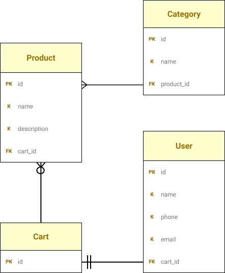

# Mobile first buffet

## Technologies

* Jest
* Heroku

### Frontend

* JavaScript
* React.js
* Tailwind
* Stripe

### Backend

* Express
* MySQL
* Sequelize

## Next Steps

[Trello](https://trello.com/b/UA9UH446/kaylas-buffet)  
[Wireframe](https://balsamiq.cloud/s7jktl8/p4vr5p3/r2278)  
[High-Fidelity-Mockup](https://break-fast.webflow.io/)  

### Steph

* Finished role obligations

### Angel

* Create wireframe for big screen
* High fidelity mockup
* Continual client management

### Rhys

* Add frontend routing for cart and main page
* Create deals and suggested items

